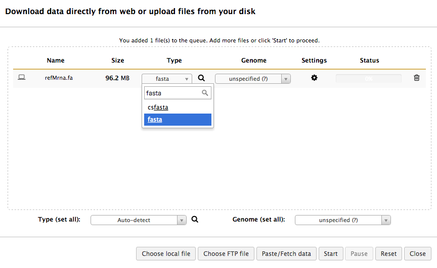
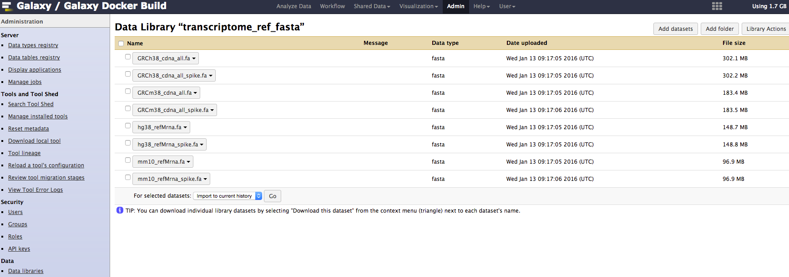
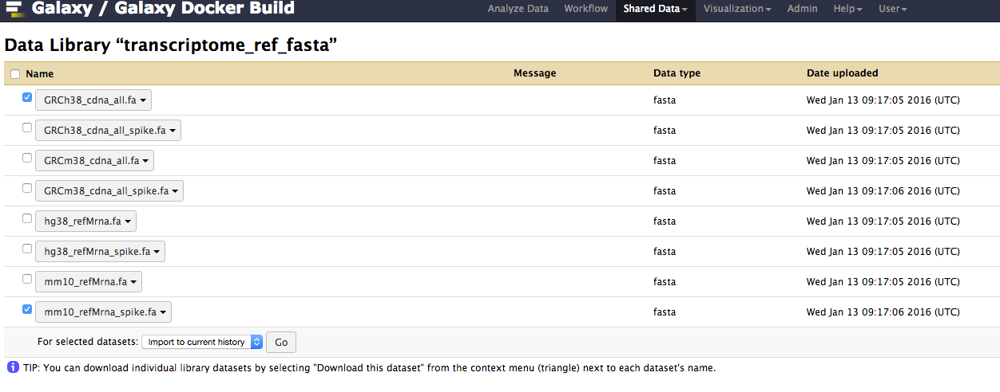
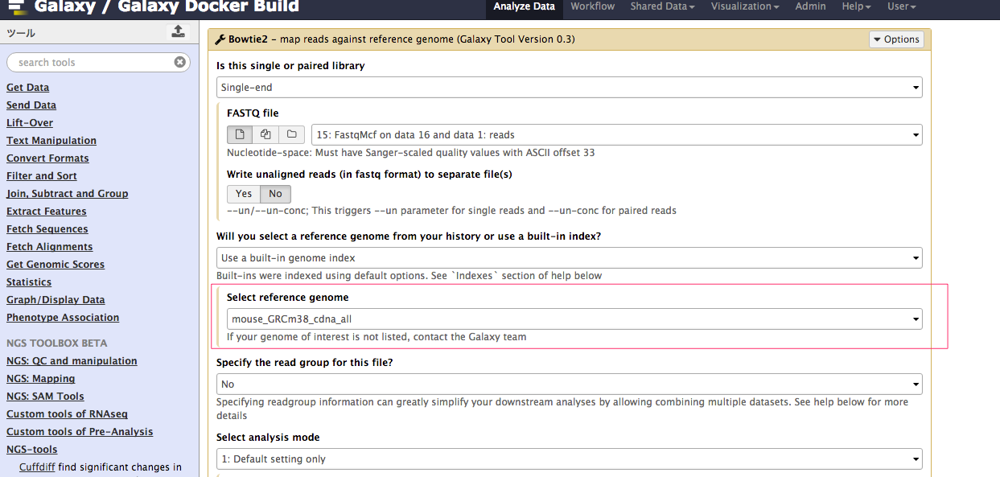

# ゲノム配列をGalaxyで使用する方法

## ローカルから直接fastaファイルをインポートして使用する
※特定のhistoryで一時的に使用したい場合に適しています

1. [Ensembl](http://asia.ensembl.org/info/data/ftp/index.html)などから、ゲノム配列のfastaファイルをダウンロードします。
1. Galaxyの左パネルの「Get Data」をクリックして、開いたリストの一番上にある「Upload File」をクリックします。
1. ダイアログが開くので、「Choose local file」をクリックしてfastaファイルを選択します。
1. 「Type (set all)」をクリックして、「fasta」を選択します。
1. 「Start」をクリックします。完了したら「Close」をクリックします。
1. 右サイドバー (ヒストリー)にファイルがインポートされていることを確認します。



## データライブラリに登録したfastaファイルを使用する
※複数のhistoryで共通して使用したい場合に適しています

***データライブラリへファイルをインポートする (注：管理者権限が必要です)***

1. 管理者権限をもつユーザでGalaxyにログインします。
1. 画面上部「Admin」メニューをクリックします。
1. 左サイドバー (管理者メニュー)の「Data > Data libraries」をクリックします。
1. 右上の「Create new data library」をクリックします。
1. 任意の名前を入力し、データをインポートするライブラリを作成します。
1. 作成したライブラリのリンクをクリックします。
1. 右上の「Add datasets」をクリックします。
1. 「Upload option」で「Upload files」を選択します。
1. 「File format」で「fasta」を選択します。
1. 「File」でインポートしたいfastaファイルを選択します。
1. 一番下の「Upload to library」をクリックします。
1. fastaファイルがライブラリへインポートされていることを確認します。



***データライブラリからヒストリーにインポートする***

1. 上部メニューの「Shared Data > Data libraries」を選択します。
1. ライブラリのリンクをクリックします。
1. インポートしたいファイルにチェックを付けます。
1. 一番下の「For selected datasets」から、「Import to current history」を選択し、「Go」をクリックします。
1. 右サイドバー (ヒストリー)にファイルがインポートされていることを確認します。



## Bowtie2インデックスを配置して使用する

* Galaxyツールのbowtie2を使用する場合に適しています

***以下は、Galaxyが動作するマシンにsshログインした上で操作してください。***

1. [iGenomes](http://support.illumina.com/sequencing/sequencing_software/igenome.html) などから、ビルド済みのbowtie2-indexを取得します。
1. ファイルを解凍し、以下のように配置されていることを確認します。
```
/data/bowtie2_index/
├── GRCm38_cdna_all
│   ├── GRCm38_cdna_all.1.bt2
│   ├── GRCm38_cdna_all.2.bt2
│   ├── GRCm38_cdna_all.3.bt2
│   ├── GRCm38_cdna_all.4.bt2
│   ├── GRCm38_cdna_all.rev.1.bt2
│   └── GRCm38_cdna_all.rev.2.bt2
```
1. ```/galaxy-central/tool-data/bowtie2_indices.loc``` を開きます。(.sampleがついている場合は、コピーして.locファイルを作成してください。)
1. 以下のように記入します。（空白はタブです）三番目の「mouse_GRCm38_cdna_all」は表示名なので任意ですが、他はファイル名と一致している必要があります。
```GRCm38_cdna_all GRCm38_cdna_all mouse_GRCm38_cdna_all   /data/bowtie2_index/GRCm38_cdna_all/GRCm38_cdna_all```
1. galaxyサービスを再起動します。
1. Bowtie2ツールの「Select reference genome」に配置したインデックス名が表示されていることを確認します。




