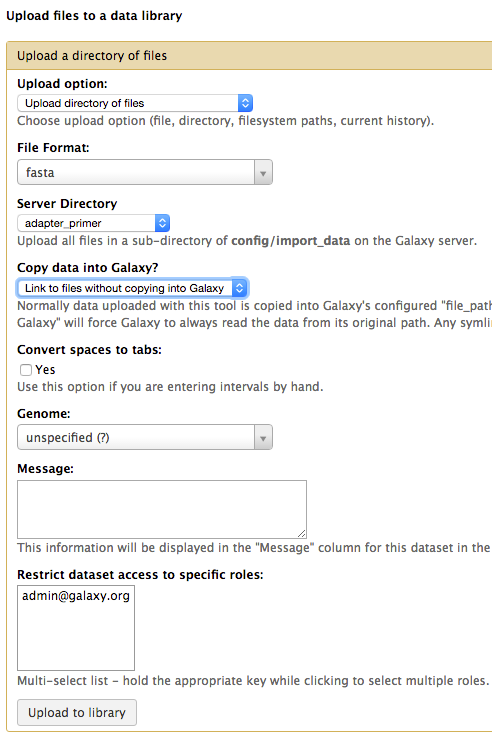
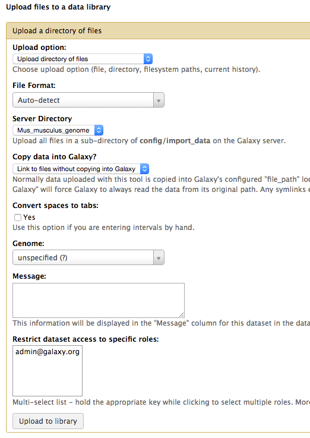
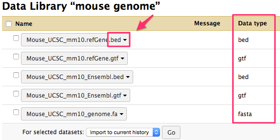
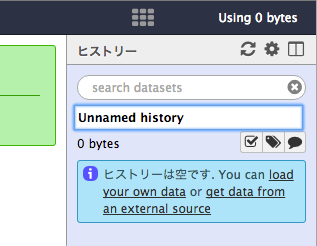
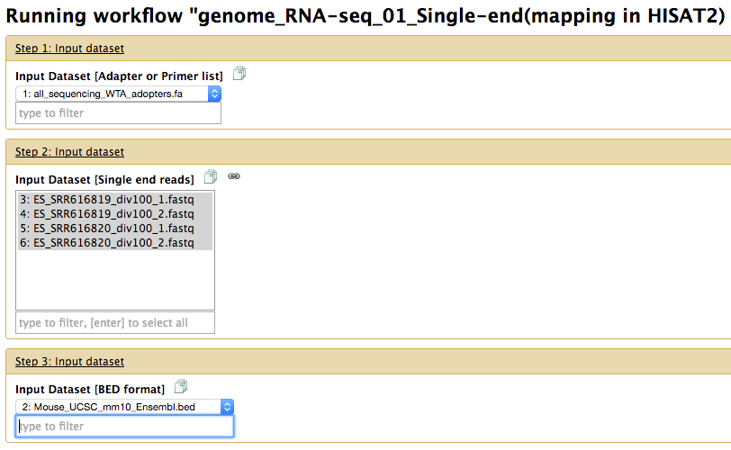
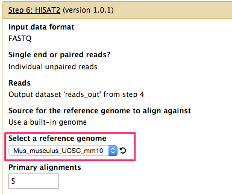

# Mapping RNA-seq reads to the genome in Galaxy

## 準備：データライブラリに必要なデータを登録する (要Admin権限, 初回のみ)

### adapter/primer配列の登録

1. 上部メニューの「Admin」を選択します。
1. 「Administration」メニューから「Data libraries」を選択します。
1. 右上の「Create new data library」を押下します。
1. "New data library" を任意の名前に変更します。(ここではadapter/primerと入力します。)
1. 「Create」を押下します。
1. 右上の「Add datasets」を押下します。
1. "Upload option"リストから「Upload directory of files」を選択します。
1. "File Format"リストから「fasta」を選択します。
1. "Server Directory"リストから「adapter_primter」を選択します。
1. "Copy data into Galaxy?"リストから「Link to files without copying into Galaxy」を選択します。
1. 「Upload to library」を押下します。

### ゲノム情報の登録 (human or mouse)

※ 再度、上記手順4まで戻ります。

- データライブラリ名 : mouse genome or human genome (任意)
- "File Format"リスト : Auto-detect
- "Server Directory"リスト : Mus_musculus_genome or Homo_sapiens_genome

入力を上記の内容に設定し、解析に必要なゲノム情報をインポートします。（数分かかります）

**インポート後、必ず"Data type"が拡張子と一致していることを確認してください。**

### fastq(fastq.gz)の登録

* ローカルからインポートする
* Data librariesにインポートする(スクリプト使用)

## WorkFlowの実行 (Mouseゲノムにマッピング、Single-End readの場合)

必要なファイル

* adapter/primer (fasta) : all_sequencing_WTA_adopters.fa
* アノテーションデータ (BED) : Mouse_UCSC_mm10_Ensembl.bed or Mouse_UCSC_mm10_refGene.bed
* fastq(fastq.gz) : 各自で用意

### ヒストリー名を設定する

1. Galaxyにログインします。
1. 右ペインの"Unnamed history" をクリックし、任意の名前に変更します。
1. Enterを押して確定します。

### 解析データをヒストリーにインポートする

1. 上部メニューの「Shared Data > Data libraries」を選択します。
1. ライブラリのリンクをクリックします。
1. インポートしたいファイルにチェックを付けます。
1. 一番下の「For selected datasets」から、「Import to current history」を選択し、「Go」をクリックします。
1. ヒストリーにファイルが全てインポートされていることを確認します。

### WorkFlowを選択する (Tophat2 or HISAT2)

1. 上部メニューの「Workflow」を選択します。
1. genome_RNA-seq_01_Single-end ... から、Tophat2 or HISAT2を選び、▼をクリックします。
1. 「Run」を選択します。
1. "Analyze Data"に自動的に遷移します。

### WorkFlowを実行する

* Input Dataset [Adapter or Primer list] に adapter/primerを設定します。
* Input Dataset [Single end reads] に fastq(fastq.gz) を設定します。(複数選択可)
* Input Dataset [BED format] に アノテーションデータ (BED) を設定します。

***Step 4: FastqMcf (version 1.0)***

* -L Maximum sequence length (none) で、readのトリミングを設定できます(デフォルト:None)

***Step 6: HISAT2 (version 1.0.1)***

* Select a reference genomeが、マッピングする対象の種であることを必ず確認してください。

* 最下部の「Run workflow」を押下します。

